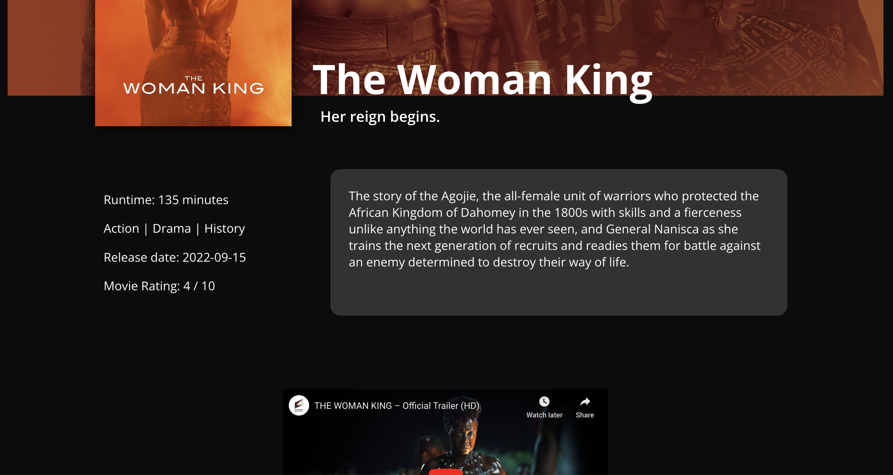

# RANCID TOMATILLOS

### Abstract:
[//]: <> (Briefly describe what you built and its features. What problem is the app solving? How does this application solve that problem?)
Rancid Tomatillos is an intereactive App that displays movie information including overviews, ratings, images, trailers, etc. to the user. Additionally, we added a "movie picker" feature that provides a randomly generated movie for users who struggle to decide what to watch. We had to access multiple API endpoints to retrieve all the necessary movie data and display it effectively on to the DOM. The big takeaway was transitioning from writing vanilla JavaScript to utilizing React, as well as implementing Router and Cypress testing for the first time.

Project spec: https://frontend.turing.edu/projects/module-3/rancid-tomatillos-v3.html

### Installation Instructions:
[//]: <> (What steps does a person have to take to get your app cloned down and running?)
- Visit the repository page: https://github.com/ericbatiste/rancid-tomatillos
- Clone the repository to your local machine
- Cd into the repository
- Run 'npm install' followed by 'npm start' in your terminal
- Enjoy the application!

### Preview of App:
##### 'Home' Page
 

##### 'Movie Details' Page

##### 'All Movies' Page

### Context:
This was a paired project at Turing School of Software & Design. We completed the project in 35 hours. This was our first time implementing React, Router, and Cypress into a Javascript application.

### Contributors:
* Dana Zack: https://github.com/dana-zack
* Eric Batiste: https://github.com/ericbatiste

### Learning Goals:
[//]: <> (What were the learning goals of this project? What tech did you work with?)
 - Gain competency with React fundamentals
 - Test React components & asynchronous JS using Cypress testing
 - Refactor application to incorperate Router, creating a multi-page UX

### Wins + Challenges:
[//]: <> (What are 2-3 wins you have from this project? What were some challenges you faced - and how did you get over them?)
* Dana: A big win was learning how to utilize useParams to majorly simplify our code. Another win was becoming comfortable with Cypress testing. The biggest challenge of the project was figuring out how to refactor to incorporate Router after having already built the project solely using conditional rendering in React.
* Eric: From the get, React seemed pretty intuitive for the both of us. It did not take us long to get momentum putting this App together. Even using cypress for the first time felt very straight forward to me and it wasn't too difficult to find the information we needed in the docs. The biggest challenge was refactoring to incorperate Router, however, once we got our heads on straight, it turned out to be no big deal.